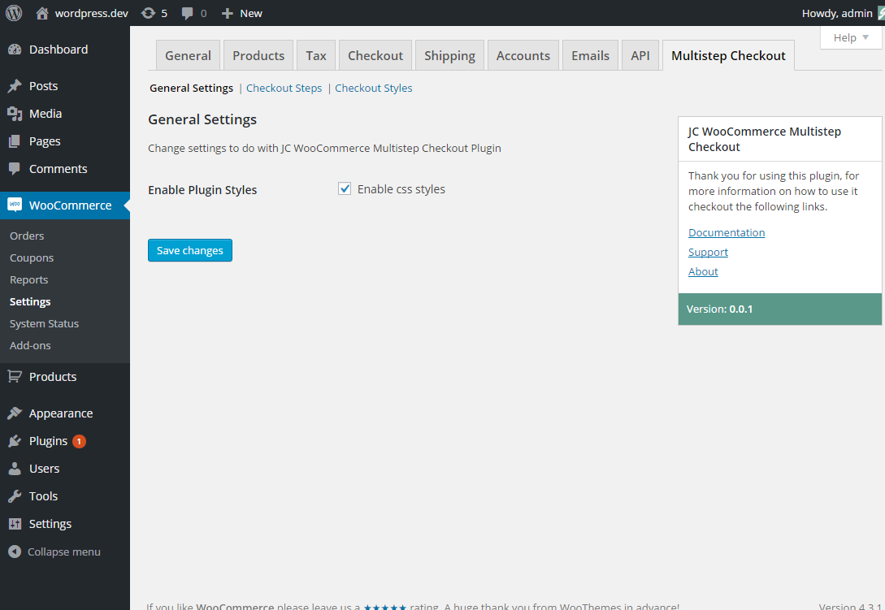
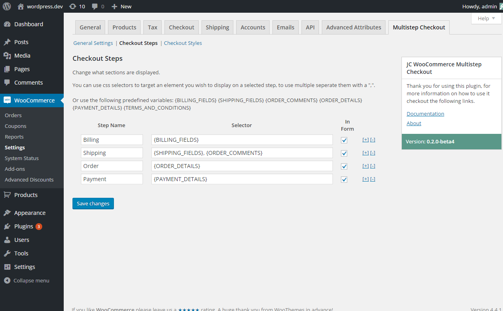
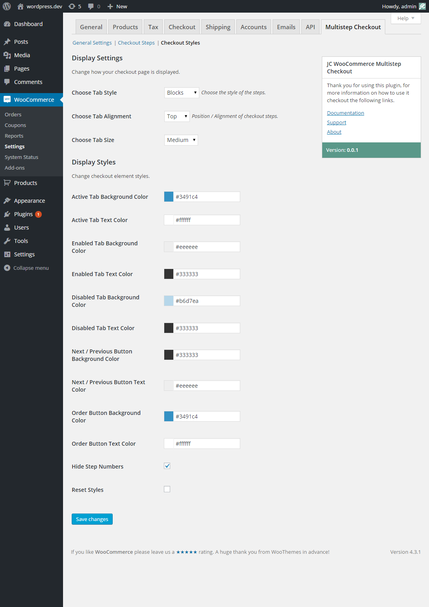
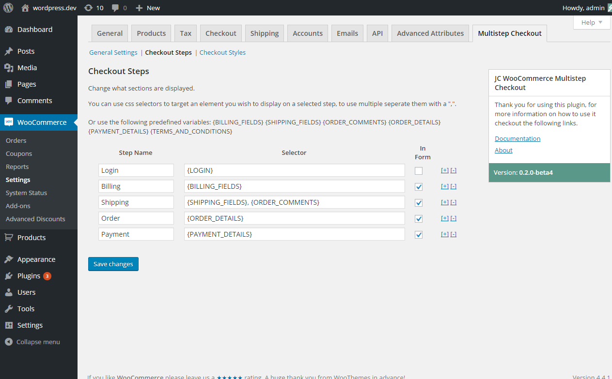

# JC WooCommerce Multipage Checkout plugin
Author: James Collings  
Version: 0.2.5  
Created: 11/01/2015  
Updated: 25/01/2015

## About

Turn the default WooCommerce single page checkout into easy to follow steps, by default the steps created are "Biiling", "Shipping", "Order", and "Payment". You can customise the design of the checkout step / tabs shown above the checkout page, the title of each step and what content is displayed on each step. 

## Features

* Multiple Checkout Step Themes
* Customise colours, sizes, and style.
* Set what information/fields are displayed on each step.
* Fully responsive to work from computers to mobile devices
* Compatiable with WPML


## Installation

1. Download a copy of the plugin
1. Copy the jc-woocommerce-multipage-checkout folder to your wordpress plugins directory, usually /wp-content/plugins/
1. Goto plugins page within Wordpress and activate JC WooCommerce Multipage Checkout plugin

## Documentation

__Table of Contents__

1. [Plugin Settings](#plugin-settings)
1. [Adding a login form step](#adding-a-login-form-step)

### Plugin Settings

All plugin settings can be found under "WooCommerce" > "Settings" > "MultiStep Checkout".

#### General Settings

Core plugin settings can be found here.



__Enable Plugin Styles__
This option will enable the "Checkout Styles" tab, giving you access to customise the display of the checkout page.

__Enable Multistep Checkout__
This option allows you to disable the multistep checkout on the front end of the website without actually deactivating the plugin.

#### Checkout Steps

Settings relating to your checkout steps and their content can be found here.



To add or remove a step, click on the plus or minus button to the right of the row, if you are adding a new empty row will appear below the row you clicked.

The left hand input field labelled name allows you to change the name of that step.
The field labelled selector allows you to set what is displayed on the page when that step is active. You can set the contents by using one of the pre defined variables:
```
{BILLING_FIELDS}
{SHIPPING_FIELDS}
{ORDER_COMMENTS}
{ORDER_DETAILS}
{PAYMENT_DETAILS}
{TERMS_AND_CONDITIONS}
```

If you wish to display more than one element make sure they are seperated with a comma. If you wish to add non default elements to the checkout page use the selector that target the wrapper of the element you wish, for example if i had a email subscription form with the id "email_subscription" added to the checkout an want to create a step on the checkout for this i would enter in the selection field:

```
#email_subscription
```

The field labeled In Form allows you to insert the section/step into the form or outside.

#### Checkout Styles

Change how your checkout is displayed.



__Choose Tab Style:__
Choose how the steps are displayed on the checkout page.

__Choose Tab Alignment:__
Choose where the steps appear on the checkout page.

__Choose Tab Size:__
Choose what size the steps will display at.

__Active Tab Background Color:__
Set the background colour for the currently chosen step.

__Active Tab Text Color:__
Set the text colour for the currently chosen step.

__Enabled Tab Background Color:__
Set the background colour for an enabled step.


__Enabled Tab Text Color:__
Set the text colour for an enabled step.

__Disabled Tab Background Color:__
Set the background colour for an disabled step.


__Disabled Tab Text Color:__
Set the text colour for an disabled step.


__Next / Previous Button Background Color:__
Set the background colour for the next and previous buttons.


__Next / Previous Button Text Color:__
Set the text colour for the next and previous buttons.


__Order Button Background Color:__
Set the background colour for the final order button.


__Order Button Text Color:__
Set the text colour for the final order button.


__Hide Step Numbers:__
Check this option if you wish to hide the step number.

__Reset Styles:__
Check this option if you wish all style options to be reset.

### Guides

#### Adding a Login form step

To add a login form which is only visible to non logged in customers, Add the following script to your theme's functions.php file. 

```
add_filter( 'jcmc_custom_section','jc_custom_section' );
function jc_custom_section($sections){

	ob_start();

	echo '<h3>Customer Login</h3>';

	woocommerce_login_form(
		array(
			'message'  => __( 'If you have shopped with us before, please enter your details in the boxes below. If you are a new customer, please proceed to the Billing &amp; Shipping section.', 'woocommerce' ),
			'redirect' => wc_get_page_permalink( 'checkout' ),
			'hidden'   => false
		)
	);

	$login_form = ob_get_clean();

	$sections['login'] = array( 
		'content' => $login_form, 	// content of the section
		'logged_in' => false 		// visible to non logged in customers
	);

	return $sections;
}
```

This will add a new variable to the sections editor page. Add the section with the variable {LOGIN} and make sure that the in form field is unchecked and looks like the image below.



#### Adding a required login / register step

To add a login and register form which is only visible to non logged in customers, Add the following script to your theme's functions.php file. 

```
/**
 * Add a required Login and Registration form to the multistep checkout
 */
add_filter( 'jcmc_custom_section','jc_custom_section' );
function jc_custom_section($sections){

	$login_form = '';

	// only render on the website frontend
	if(!is_admin()){

		$checkout_url = WC()->cart->get_checkout_url();

	    ob_start(); ?>

	    <div id="jcmc_login_notices"></div>

		<?php do_action( 'woocommerce_before_customer_login_form' ); ?>

		<div class="col2-set" id="customer_login">

			<div class="col-1">

				<h2><?php _e( 'Login', 'woocommerce' ); ?></h2>

				<form method="post" class="login">

					<?php do_action( 'woocommerce_login_form_start' ); ?>

					<p class="form-row form-row-wide">
						<label for="username"><?php _e( 'Username or email address', 'woocommerce' ); ?> <span class="required">*</span></label>
						<input type="text" class="input-text" name="username" id="username" value="<?php if ( ! empty( $_POST['username'] ) ) echo esc_attr( $_POST['username'] ); ?>" />
					</p>
					<p class="form-row form-row-wide">
						<label for="password"><?php _e( 'Password', 'woocommerce' ); ?> <span class="required">*</span></label>
						<input class="input-text" type="password" name="password" id="password" />
					</p>

					<?php do_action( 'woocommerce_login_form' ); ?>

					<p class="form-row">
						<?php wp_nonce_field( 'woocommerce-login' ); ?>
						<input type="submit" class="button" name="login" value="<?php esc_attr_e( 'Login', 'woocommerce' ); ?>" />
						<input type="hidden" name="redirect" value="<?php echo $checkout_url; ?>">
						<label for="rememberme" class="inline">
							<input name="rememberme" type="checkbox" id="rememberme" value="forever" /> <?php _e( 'Remember me', 'woocommerce' ); ?>
						</label>
					</p>
					<p class="lost_password">
						<a href="<?php echo esc_url( wp_lostpassword_url() ); ?>"><?php _e( 'Lost your password?', 'woocommerce' ); ?></a>
					</p>

					<?php do_action( 'woocommerce_login_form_end' ); ?>

				</form>

			</div>

			<div class="col-2">

				<h2><?php _e( 'Register', 'woocommerce' ); ?></h2>

				<form method="post" class="register">

					<?php do_action( 'woocommerce_register_form_start' ); ?>

					<?php if ( 'no' === get_option( 'woocommerce_registration_generate_username' ) ) : ?>

						<p class="form-row form-row-wide">
							<label for="reg_username"><?php _e( 'Username', 'woocommerce' ); ?> <span class="required">*</span></label>
							<input type="text" class="input-text" name="username" id="reg_username" value="<?php if ( ! empty( $_POST['username'] ) ) echo esc_attr( $_POST['username'] ); ?>" />
						</p>

					<?php endif; ?>

					<p class="form-row form-row-wide">
						<label for="reg_email"><?php _e( 'Email address', 'woocommerce' ); ?> <span class="required">*</span></label>
						<input type="email" class="input-text" name="email" id="reg_email" value="<?php if ( ! empty( $_POST['email'] ) ) echo esc_attr( $_POST['email'] ); ?>" />
					</p>

					<?php if ( 'no' === get_option( 'woocommerce_registration_generate_password' ) ) : ?>

						<p class="form-row form-row-wide">
							<label for="reg_password"><?php _e( 'Password', 'woocommerce' ); ?> <span class="required">*</span></label>
							<input type="password" class="input-text" name="password" id="reg_password" />
						</p>

					<?php endif; ?>

					<!-- Spam Trap -->
					<div style="<?php echo ( ( is_rtl() ) ? 'right' : 'left' ); ?>: -999em; position: absolute;"><label for="trap"><?php _e( 'Anti-spam', 'woocommerce' ); ?></label><input type="text" name="email_2" id="trap" tabindex="-1" /></div>

					<?php do_action( 'woocommerce_register_form' ); ?>
					<?php do_action( 'register_form' ); ?>

					<p class="form-row">
						<?php wp_nonce_field( 'woocommerce-register' ); ?>
						<input type="submit" class="button" name="register" value="<?php esc_attr_e( 'Register', 'woocommerce' ); ?>" />
					</p>

					<?php do_action( 'woocommerce_register_form_end' ); ?>

				</form>

			</div>

		</div>

		<script>
		jQuery(function($){

			$('body').on('jcmc_validation', '.jcmc-active-tab', function(event){

				var custom_tab = $('#jcmc-wrap').find('#login.jcmc-custom-section').parents('.jcmc-tab');
				if( custom_tab.hasClass('jcmc-active-tab') ){

					$('#jcmc_login_notices').html('');
					$('#jcmc_login_notices').append('<div class="woocommerce-error">Please Login or Register using the forms below.</div>');
					custom_tab.addClass('jcmc-invalid');
				}			
			});
		});
		</script>

		<?php do_action( 'woocommerce_after_customer_login_form' );

	    $login_form = ob_get_clean();

	}

    $sections['login'] = array( 
        'content' => $login_form,     // content of the section
        'logged_in' => false         // visible to non logged in customers
    );

    return $sections;
}

/**
 * Add filter to change the redirect url once a user has been redirected for the checkout page only
 */
add_filter('woocommerce_registration_redirect', 'jcmc_checkout_registration_redirect', 20);
function jcmc_checkout_registration_redirect( $redirect_to ) {

	if(is_admin()){
		return;
	}

	// redirect to checkout page if from checkout page
	if(isset($_POST['_wp_http_referer']) && $_POST['_wp_http_referer'] == str_replace( site_url( '' ), '', WC()->cart->get_checkout_url() )){
		$redirect_to = WC()->cart->get_checkout_url();	
	}	
	
	return $redirect_to;
}
```

This will add a new variable to the sections editor page. Add the section with the variable {LOGIN} and make sure that the in form field is unchecked and looks like the image below.


## Changelog

### 0.2.5
* Fix ordering issue with selectors when payment and order details are on the same tab
* Stop javascript running on order-pay and order-recieved checkout pages

### 0.2.2
* Fix issue with redirecting to tab 2 on update checkout trigger

### 0.2.1
* Fix bug on install causing checkout sections to be empty

### 0.2
* Add Progress style
* Fix some minor style bugs
* Add ability to easily add custom sections
* Insert sections inside/outside the checkout form, useful for coupon and login form.

### 0.1
* Plugin released